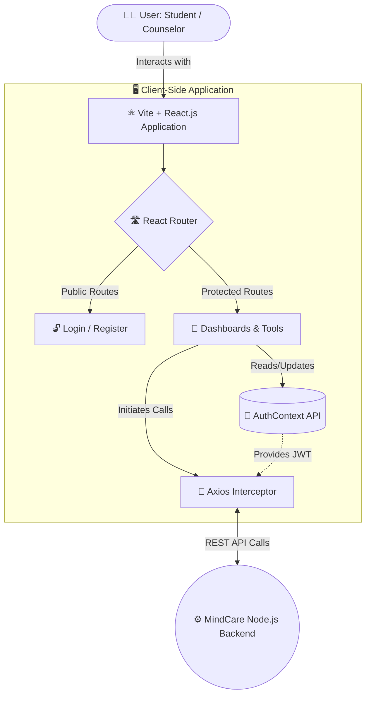

# 🌿 MindCare - Mental Health Support System (Frontend)

---

## 📌 1. Project Overview
**MindCare** is a dedicated mental health support platform designed to help students manage academic stress 📚, track their emotional well-being 🧠, and connect with professional counselors 👨‍⚕️. The frontend provides a seamless, calming, and responsive user interface that encourages daily engagement through various mental health tools. It acts as the primary interactive layer for the entire MindCare ecosystem! ✨

---

## 🎯 2. Problem Description
Students frequently experience academic stress, anxiety, and emotional challenges, yet often lack access to immediate, discreet, and structured mental health support. 
*   🧱 **High Barriers:** Existing systems are either too clinical, difficult to navigate, or lack daily engagement tools.
*   🤐 **Stigma:** Many students feel uncomfortable seeking in-person help due to the stigma surrounding mental health.
*   🚑 **Proactive vs. Reactive:** Most systems only offer help *after* a crisis has occurred, rather than providing tools for proactive mental well-being management.

---

## 💡 3. Proposed Solution
MindCare bridges the gap by providing an aesthetic, user-friendly web interface where students can access various self-help tools and connect with professionals anonymously or discreetly. 
*   🛠️ **Self-Help Integration:** It offers daily journaling, mood tracking, guided mindfulness exercises, and academic stress management. 
*   🤝 **Professional Bridge:** By integrating these tools into a single platform, students can manage their stress proactively and easily submit support requests to registered counselors when they need human intervention.

---

## ✨ 4. Key Features & Functionality

### 👔 4.1 Role-Based Dashboards
*   🎓 **Student Dashboard**: A personalized hub providing quick access to mood trackers, journals, academic tools, and the status of their active support requests.
*   💼 **Counselor Dashboard**: A secure interface for verified professionals to view incoming student requests, manage their caseload, and update the status of ongoing therapies.

### 🧘‍♀️ 4.2 Mental Health & Self-Therapy Tools
*   📊 **Mood Tracker**: A visual logging system allowing users to record their daily emotions (1-10 scale), helping them identify patterns and triggers over time.
*   📓 **Daily Journal (Text & Voice)**: A secure space for reflection. Users can type their thoughts or use the integrated voice-to-text recording feature for effortless journaling.
*   ⏱️ **Mindfulness Timer**: A guided, interactive breathing exercise tool designed for immediate stress and anxiety relief (e.g., 4-7-8 breathing technique).
*   📚 **Self-Therapy Hub**: A curated repository of automated resources, cognitive behavioral therapy (CBT) exercises, and psychological reading materials.

### 📅 4.3 Academic Stress Management
*   🎒 **Academic Manager**: A dedicated tracking tool helping students organize their assignments, monitor deadlines, and calculate study hours to prevent academic burnout.

### 🆘 4.4 Support Request System
*   ✉️ **Discreet Requests**: Students can securely submit requests outlining their concerns (e.g., Anxiety, Depression, Academic Pressure).
*   🔍 **Counselor Directory**: A searchable list of available counselors, filtering by their specific specializations.
*   📡 **Real-time Tracking**: Students can monitor whether their request is `Pending`, `Accepted`, or `Resolved`.

---

## 🧩 5. Component Deep Dive

The React application is highly modular. Here are some of the core components:

*   🧭 **`Navbar.jsx`**: Handles responsive navigation and conditional rendering based on the user's authentication state and role (Student vs. Counselor). Includes a hamburger menu for mobile views.
*   🛡️ **`ProtectedRoute.jsx`**: A Higher-Order Component (HOC) that wraps private routes. If a user is not authenticated, it immediately redirects them to the `/login` page, preventing unauthorized access.
*   📇 **`RequestCard.jsx`**: A reusable UI component used to display support requests. It conditionally renders action buttons (Accept, Resolve) if the user viewing it is a Counselor.
*   🧠 **`AuthContext.jsx`**: The central nervous system of the frontend's state. It holds the JWT token, user profile data, and provides `login` and `logout` functions to the entire component tree without prop-drilling.

---

## 🎨 6. UI/UX Design Principles
*   🍃 **Calming Aesthetics**: Designed with a carefully selected color palette (soft blues, greens, and neutral tones) to evoke a sense of calm, safety, and trustworthiness.
*   📱 **Responsive Layout**: Built with a mobile-first approach. Flexbox and CSS Grid are heavily utilized to ensure the platform is accessible on phones, tablets, and desktops.
*   👁️ **Accessibility (a11y)**: High-contrast text, semantic HTML, clear iconography, and intuitive navigation patterns to ensure usability for all students, including those with visual impairments.
*   ⚡ **Immediate Feedback**: Integrated loaders (`Loader.jsx`) and clear state transitions to provide users with confidence during data fetching and form submissions.

---

## 🛠️ 7. Technologies & Architecture

### 💻 7.1 Core Stack
*   ⚛️ **Framework**: React.js (v19)
*   ⚡ **Build Tool**: Vite (chosen for its lightning-fast Hot Module Replacement (HMR) and optimized Rollup production builds).
*   🛣️ **Routing**: React Router DOM (v7) for dynamic, client-side routing and seamless page transitions.

### 🔄 7.2 State & API Management
*   🌍 **Global State**: React Context API (`AuthContext.jsx`).
*   📡 **HTTP Client**: Axios. We utilize an `axiosInstance.js` file to create an Axios interceptor. This automatically attaches the JWT token from `localStorage` to the `Authorization` header of every outbound API request.

### 💅 7.3 Styling
*   🎨 **CSS Architecture**: Vanilla CSS paired with utility classes, centralized in `index.css` for maintaining a consistent design system without the overhead of heavy UI libraries.
*   🖼️ **Icons**: `react-icons` for lightweight, scalable vector graphics.

---

## 🏗️ 7.4 System Architecture Diagram



---

## 🌐 8. API Endpoints (Integration Map)
The frontend communicates with the backend via the following key services defined in the `src/api/` folder:

### 🔑 Authentication (`authApi.js`)
*   🟢 `POST /login`: Authenticates user credentials.
*   🟢 `POST /register-user`: Creates a new student account.
*   🟢 `POST /register-counselor`: Creates a new counselor account.

### 📝 Support Requests (`requestApi.js`)
*   🔵 `GET /`: Fetches requests.
*   🔵 `POST /`: Submits a new support ticket.
*   🔵 `PUT /:id`: Updates request status (Counselor only).
*   🔴 `DELETE /:id`: Removes a request.

### 👨‍⚕️ Counselors (`counselorApi.js`)
*   🔵 `GET /counselors`: Fetches the directory of available counselors for the Student view.

---

## 📂 9. Complete Folder Structure
```text
Frontend/
+--- .env 🔐
+--- eslint.config.js ⚙️
+--- index.html 📄
+--- package-lock.json 📦
+--- package.json 📦
+--- public/ 📁
|   +--- favicon.svg 🖼️
|   \--- icons.svg 🖼️
+--- README.md 📖
+--- ScreenShots/ 📸
|   +--- breath exercise page.png
|   +--- Counselor account.png
|   +--- Counselor Dashboard 2.png
|   +--- Counselor Dashboard.png
|   +--- Counselor list page.png
|   +--- Landing page (Home page)4.png
|   +--- Landing page (Home).png
|   +--- Landing Page (Home)2.png
|   +--- Landing page (Home)3.png
|   +--- Login Page.png
|   +--- Screenshot 2026-05-16 122043.png
|   +--- Self Theraphy hub.png
|   +--- Self therapy hub 2.png
|   +--- Self Therapy Hub 3.png
|   +--- Sign up (Register) page for Counselor.png
|   +--- Sign up (Register) page for student.png
|   +--- Sttings bar.png
|   +--- Student account page.png
|   +--- student Dashboard.png
|   \--- Student list page.png
+--- src/ 💻
|   +--- api/ 📡
|   |   +--- authApi.js
|   |   +--- axiosInstance.js
|   |   +--- counselorApi.js
|   |   \--- requestApi.js
|   +--- App.jsx ⚛️
|   +--- assets/ 🖼️
|   |   +--- auth_bg.png
|   |   +--- hero.png
|   |   +--- react.svg
|   |   +--- slide1.png
|   |   +--- slide2.png
|   |   +--- slide3.png
|   |   +--- slide4.png
|   |   +--- slide5.png
|   |   \--- vite.svg
|   +--- components/ 🧩
|   |   +--- Loader.jsx
|   |   +--- Navbar.jsx
|   |   \--- RequestCard.jsx
|   +--- context/ 🧠
|   |   \--- AuthContext.jsx
|   +--- data/ 💾
|   +--- index.css 🎨
|   +--- main.jsx 🚀
|   +--- pages/ 📄
|   |   +--- AcademicManager.jsx
|   |   +--- CounselorDashboard.jsx
|   |   +--- CounselorsListPage.jsx
|   |   +--- DailyJournal.jsx
|   |   +--- LandingPage.jsx
|   |   +--- LoginPage.jsx
|   |   +--- MindfulnessTimer.jsx
|   |   +--- MoodTracker.jsx
|   |   +--- ProfilePage.jsx
|   |   +--- RegisterPage.jsx
|   |   +--- RequestDetailsPage.jsx
|   |   +--- SelfTherapyPage.jsx
|   |   +--- StudentDashboard.jsx
|   |   \--- UsersListPage.jsx
|   \--- routes/ 🛣️
|       \--- ProtectedRoute.jsx
\--- vite.config.js ⚙️
```

---

## 🚀 10. Setup & Installation Instructions

### 📋 Prerequisites
*   🟢 Node.js (v16 or higher)
*   📦 npm or yarn package manager
*   ⚙️ A running instance of the MindCare Backend API.

### 📥 10.1 Clone the repository
```bash
git clone <your-frontend-repo-url>
cd frontend
```

### 📦 10.2 Install Dependencies
```bash
npm install
```

### ⚙️ 10.3 Environment Configuration
Create a `.env` file in the root directory. You must define the base URL for the backend API:
```env
VITE_API_URL=http://localhost:5000/api
```

### ▶️ 10.4 How to Run the Project
Start the Vite development server:
```bash
npm run dev
```
The application will be served at `http://localhost:5173`. Open this address in your browser. 🌐

### 🏗️ 10.5 Build for Production
To create an optimized, minified production build:
```bash
npm run build
npm run preview # To test the production build locally
```

---

## 🧪 11. Testing Strategy (Proposed)
While currently in active development, the testing roadmap includes:
*   🧪 **Unit Testing**: Utilizing `Jest` and `React Testing Library` to test individual components like `RequestCard` and `Loader`.
*   🔗 **Integration Testing**: Mocking Axios requests with `msw` (Mock Service Worker) to ensure pages like `CounselorDashboard` render correctly when provided with mock API data.
*   🤖 **E2E Testing**: Implementing `Cypress` to automate full user flows (e.g., logging in as a student and submitting a journal entry).

---

## 🤝 12. Contributing Guidelines
We welcome contributions! To contribute:
1. 🍴 Fork the repository.
2. 🌱 Create a new feature branch (`git checkout -b feature/AmazingFeature`).
3. 💾 Commit your changes (`git commit -m 'Add some AmazingFeature'`).
4. 🚀 Push to the branch (`git push origin feature/AmazingFeature`).
5. 📬 Open a Pull Request.

---

## 📦 13. Deliverables
*   💻 **Source Code**: Complete React.js frontend repository.
*   📖 **Documentation**: This README file outlining architecture, setup, and features.
*   🎨 **UI Assets**: Custom CSS and image assets used within the platform.
*   📸 **Demonstration**: Screenshots of key interfaces (Dashboards, Mood Tracker, etc.) located in the `ScreenShots/` directory.

---

## ⚠️ 14. Threats & Limitations
*   🔌 **Dependency on Backend**: The frontend is fully reliant on the backend API. If the server is down, the UI cannot function independently.
*   🌐 **Browser Compatibility**: While built with modern web standards, extremely outdated browsers may not render the CSS Grid/Flexbox layouts perfectly.
*   🧹 **Data Persistence**: If local storage is cleared by the user, their active session (JWT token) will be lost, requiring re-authentication.

---

## 🏁 15. Conclusion
The MindCare Frontend successfully delivers a calming, intuitive, and accessible interface for students seeking mental health support 🌿. By integrating daily self-help tools with a direct line to professional counselors, it lowers the barrier to entry for mental health care and encourages proactive emotional management in a stressful academic environment. 🎓

---

## 👩‍💻 Developed By
**Harshani Sandunika Ranasingha**  
💳 **Student ID**: 2022/ict/78


